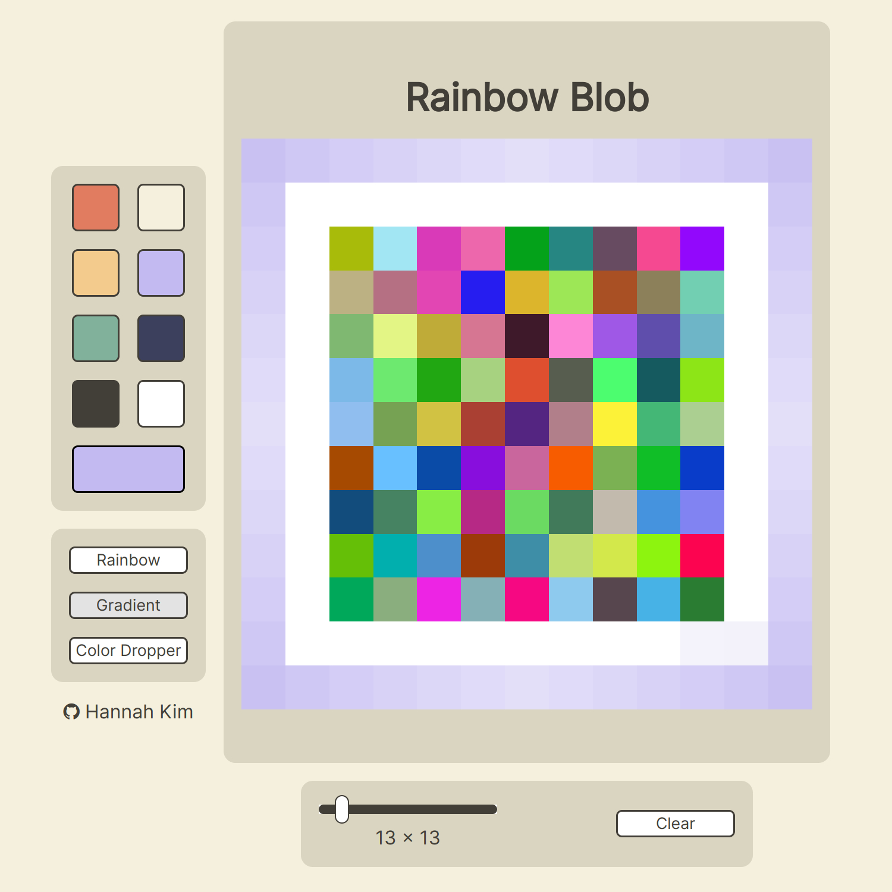

# Sketchpad

https://hannahkim313.github.io/sketchpad/

## Project Summary

This project exercise, created by the Odin Project, is a browser version of a
sketchpad/etch-a-sketch in which the user can draw colored pixels onto a canvas.
Some of the key features implemented into this sketchpad are as follows:

* An option for the user to change the name of the canvas
* A small color palette that serves as both a way for the user to select their
    own color and show which color is currently selected
* A rainbow button that, when toggled on, randomly selects a color for every
    pixel drawn on the canvas
* A gradient button that, when toggled on, decreases the shade of the selected
    color after every few pixels until it is completely white
* A color dropper button that, when toggled on, lets the user click any color
    on the canvas to change the currently selected color into the newly selected
    one
* A slider that allows the user to change the size of the pixels on the canvas
* A clear button that deletes everything on the canvas

## In Action

## Goals

For this project, I hope to create both a UI-friendly and an aesthetically
pleasing sketchpad program. Further research and learning outside of the
curriculum will be conducted to achieve the desired results, especially when
it comes to CSS and DOM manipulation. By the end of the project, I will gain
a better understanding of how to further style elements and add functionality
to my program using new JavaScript methods.